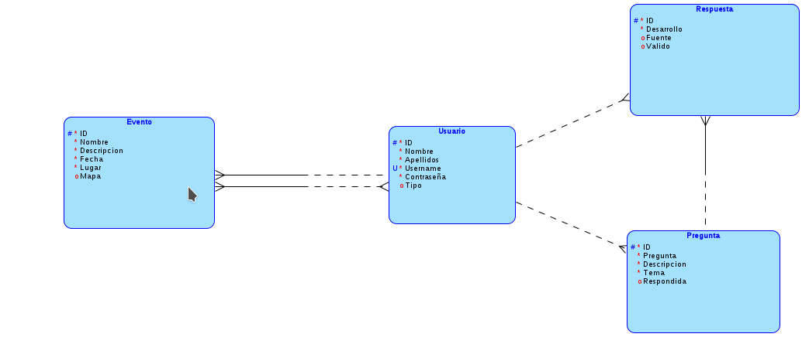

# Planning 

## Esquema de la web

### Páginas necesarias

1. Índice
2. Inicio de sesión
3. Registro
4. Pregunta
5. Perfil
6. Formula preguntas
7. Formula respuestas
8. Eventos
9. Crea evento
10. Sobre nosotros
11. Administracion

### Descripción básica

* Índice: Informacion y contacto
* Inicio sesion: Formulario de inicio sesión
* Registro: Formulario del registro del usuario
* Pregunta: Pregunta en concreto
* Perfil: Datos de un usuario en concreto
* Formula preguntas: Formulario para crear una pregunta
* Formula respuesta: Formulario para crear la respuesta a una pregunta
* Eventos: Listado de los eventos
* Formula eventos: Formulario para crear un evento
* Sobre nosotros: Página de contacto
* Administracion: Pagina para administrar los usuarios

### Descripción detallada

* Índice: se lista cada una de las preguntas accediendo a la base de datos. Cada pregunta es un enlace a dicha pregunta. Solo se muestra la pregunta y no su descripción ni respuestas. Se incluira la información de la empresa GivAid. Se incluye también el correo electronico para que las empresas puedan contactar con nosotros y proveernos la información necesaria para que verifiquemos que son una empresa válida. Luego el usuario administrador cambiara el tipo del usuario para que pueda crear eventos
* Inicio de sesión: se comprueba que el usuario ha introducido los datos correctamente viendo si el usuario existe en la base de datos y su contraseña está bien
* Registro: Se insertan los datos introducidos por el usuario en la base de datos, comprobando antes de insertarlos. Se debe comprobar que el usuario no contiene caracteres especiales y que la contraseña tiene al menos 8 caracteres.
* Pregunta: Se hace un select de la id de la pregunta recogida en la url y se muestran los datos de la pregunta. En esta página también se incluyen las respuestas que vayan dando los usuarios y una opción para responder. Si el usuario está verificado se mostrará una marca a su lado. Se puede acceder al perfil de un usuario haciendo clic en su nombre de usuario. El usuario consultor puede marcar una respuesta como la correcta.
* Perfil: Se mostrarán los datos de un usuario en concreto, esto incluye las preguntas que ha hecho dicho usuario y las preguntas que ha respondido. Si el usuario accede a su propio perfil tendrá la opción de modificar sus datos.
* Formula preguntas: Se pide al usuario que introduzca la pregunta en sí, una descripción donde desarrolle más sobre su consulta y el tema al que pertenece la pregunta. Se comprobará si hay alguna pregunta con el mismo nombre para evitar duplicados. La pregunta se insertará en la base de datos.
* Formula respuestas: Un pequeño formulario donde el contribuyente responde a una pregunta y añade las fuentes de su respuesta si las tiene.
* Eventos: Se listarán los eventos que crean las organizaciones, se mostraran primero los proximos eventos y luego los eventos que ya han acabado. 
* Formula eventos: Los usuarios que esten marcados como organizacion podran crear eventos. Deben añadir la fecha y el lugar del evento, así como una descripción de lo que se hará en dicho evento. 
* Administracion: Pagina a la que tendra solo acceso un usuario llamado "administrador" donde el admin puede ver todos los usuarios creados y modificarlos. Desde aqui el admin puede marcar a un usuario como empresa.

## Base de datos

### Esquema básico

Usando sqlite se guardarán los datos sobre usuarios, preguntas y respuestas. Para el funcionamiento correcto del programa necesitamos la siguiente información:
* Usuario: id única, nombre de usuario también único, nombre, apellidos y una contraseña que guardaremos en md5. También nos hara falta un valor booleano para saber si el usuario es empresa o no. 
* Pregunta: id única, la pregunta en sí, una descripción, un tema, y un booleano para saber si la pregunta está respondida o no
* Respuesta: id única, el desarrollo de la respuesta y un booleano que indique si el consultor ha marcado la respuesta como válida o no
* Evento: id unica, nombre, descripcion, fecha, lugar, mapa

## Diseño
Vamos a usar los colores complementarios azul y naranja, de la misma manera que se ha usado en el logo de GivAid. Se intentará tener un diseño sencillo y moderno

## Primer prototipo

En el primer prototipo de nuestra página web hemos creado las funcionalidades básicas más importantes. Estas incluyen:
* Registrarse e Iniciar sesión
* Poder crear eventos (usuarios permitidos) y participar en ellos
* Crear preguntas y responderlas
* El administrador puede cambiar los valores de los usuarios
* Perfil de cada usuario

### Funcionalidades implementadas

#### Registro e Inicio de Sesión

Usamos las clases de session para guardar los parámetros de cada usuario en su propia sesión, esto facilita la inserción de datos ya que no tenemos que acceder a la base de datos antes de insertar datos en la misma.

El registro de los usuarios inserta un usuario en la base de datos, comprobando primero que no hay ningún usuario con el mismo nombre de usuario.

#### Creación de eventos y participación

Cada usuario registrado puede crear un evento, siempre que sea de tipo "Organización" (1). Los datos del formulario se introducen en la base de datos para luegos ser mostrados. Todos los usuarios independientemente de su tipo pueden hacer click en participar para que en la base de datos consta que participas.

#### Creación de preguntas y responderlar

Todo usuario registrado tiene la posibilidad de crear preguntas y responderlas. Las preguntas se insertan en la base de datos en una tabla que esta relacionada con la tabla respuestas, a su vez respuestas está relacionada con usuarios. De esta manera podemos mostrar las respuestas de cada pregunta y qué usuario es el que ha respondido.

#### Administración

Tenemos un usuario llamado admin que, si inicia sesión, es redireccionado automáticamente a la página de administración. Este usuario puede cambiar los datos de los usuarios como el tipo. Estos cambios se actualizan en la base de datos usando UPDATE.

#### Perfil de usuario

Podemos acceder a los perfiles de los diferentes usuarios desde todas partes. Se muestra un enlace cada vez que se muestra el nombre de un usuario, de esta manera puedes comprobar si el usuario que ha respondido tu pregunta es confiable. En el perfil se muestran los datos básicos así como las preguntas que ha creado cada usuario, el número de respuestas y sus skills.

Los skills que se muestran van acorde al tema de las preguntas que ha respondido un usuario.

### Cosas a implementar o mejorar

Este prototipo no tiene todas las funcionalidades que planteadas, en la versión final de GivAid se podría implementar:
* Validación de respuestas
* Upvote o downvote de respuestas
* Permitir al usuario modificar su perfil
